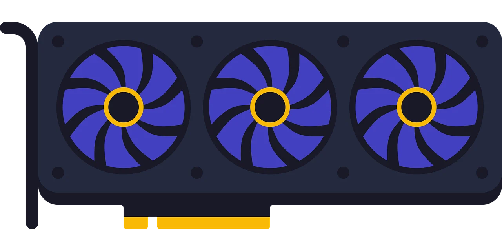

<div align="center">
  
  <h1>GPU vs IEEE 754: Análisis Numérico en Gráficos 3D</h1>
  <p><strong>Un proyecto de investigación interactivo sobre cómo el hardware gráfico desafía el análisis numérico.</strong></p>
  
  [](https://reactjs.org/)
  [](https://vitejs.dev/)
  [](https://tailwindcss.com/)
</div>

<br />

## 📖 Sobre el Proyecto

Este repositorio contiene una aplicación web interactiva desarrollada para la asignatura de **Análisis Numérico** de la **Universidad Nacional de Colombia**.

El propósito central de este informe de laboratorio virtual es responder a la pregunta de investigación:
> **_¿Cómo interactúan las GPU con las representaciones en punto flotante (IEEE 754) para procesar gráficos 3D?_**

En lugar de ser un documento de texto estático, el proyecto fue construido como una experiencia inmersiva con laboratorios interactivos (simuladores de trazado de rayos, visualizadores de árboles BVH y análisis de rebotes físicos). Exploramos cómo los computadores sacrifican precisión matemática infinita a favor del paralelismo masivo para renderizar simulaciones físicas en tiempo real.

## 👥 Equipo de Investigación y Módulos

La investigación está dividida en 4 módulos principales, cada uno enfocado en un problema matemático distinto resuelto por el hardware gráfico:

1. **Juan Huertas — Normalización de Vectores (Bits y RSQRT)** 
   Estudio del legendario algoritmo *Fast Inverse Square Root* de Quake III. Cómo la manipulación a nivel de bits de un número flotante permite aproximaciones logarítmicas inmediatas que luego son pulidas mediante Newton-Raphson.

2. **Deyvi Ardila — Geometría y Luz (Trazado de Rayos)**
   Análisis del problema del *Shadow Acne*. Demostramos visual y analíticamente por qué las GPU modernas usan un pipeline de precisión mixta: `Float32` para intersecciones espaciales (evitando que los rayos colisionen consigo mismos) y `Float16` para la gradación de colores.

3. **Nicolás Betancur — Laboratorio Físico (Intersección y Rebote)**
   Evaluación de los límites de precisión en grandes distancias y ángulos rasantes. Análisis de los residuos negativos que causan fallos instantáneos en el rebote de la luz y cómo se corrige matemáticamente aplicando desplazamientos épsilon.

4. **Germán — Orientación Espacial (Cuaterniones y Rotaciones)**
   Investigación sobre cómo las matrices de rotación sufren de *Gimbal Lock* y cómo los cuaterniones ofrecen una alternativa estable. Laboratorios interactivos para observar la acumulación del error numérico en rotaciones 3D sucesivas.

## 🚀 Despliegue en Vivo

Puedes explorar la aplicación y los simuladores interactivos directamente desde tu navegador:

🔗 **[Ver Proyecto en Vivo](http://gpu-fp-analysis.juanhu.dev/)** 

## 🛠️ Instalación y Ejecución Local

Si deseas correr el proyecto en tu propia máquina para explorar el código fuente, sigue estos pasos:

### Prerrequisitos
- Node.js (v18 o superior)
- Git

### Paso a paso
1. **Clona el repositorio:**
   ```bash
   git clone https://github.com/spartan14799/gpu-fp-analysis-.git
   cd gpu-fp-analysis-
   ```

2. **Instala las dependencias:**
   ```bash
   npm install
   ```

3. **Inicia el servidor de desarrollo:**
   ```bash
   npm run dev
   ```

4. **Visualiza la aplicación:**
   Abre tu navegador web y visita `http://localhost:5173`.

## 🧠 Estructura del Código

El proyecto fue construido utilizando **Vite** como empaquetador y **React** como librería principal de renderizado de la UI, con **Tailwind CSS** para los estilos modulares.

```text
src/
├── components/       # Componentes reusables (Laboratorios, Visualizadores BVH, Fórmulas)
├── lib/              # Configuración (Rutas, Constantes de Navegación)
├── pages/            # Vistas enrutadoras (Landing, Layouts)
└── sections/         # Contenido Teórico por módulos (Resultados, Conclusiones, Teoría)
```

## 🤖 Uso de Inteligencia Artificial

Como parte de la metodología académica, la concepción teórica y el andamiaje del proyecto fueron apoyados por **Gemini 3.1 Pro (Antigravity Agent)**. La IA fue utilizada para aterrizar conceptos altamente técnicos de arquitectura de computadores (IEEE 754) a explicaciones digeribles y ayudar en la estructuración matemática de los simuladores físicos de Ray Tracing. Documentado formalmente en la sección interna del proyecto.

---
*Desarrollado para la Universidad Nacional de Colombia.*
